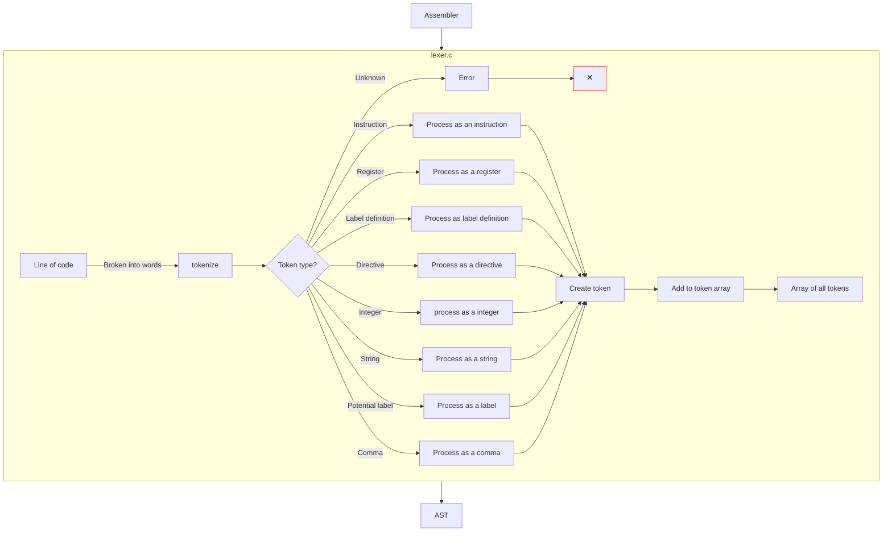
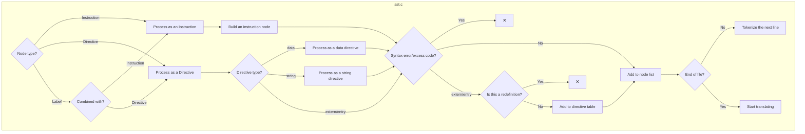
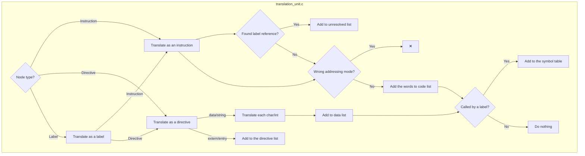
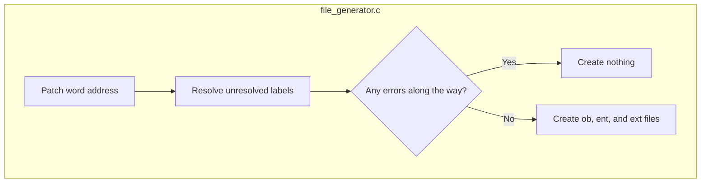

One-Pass Assembler
Overview

This project is a one-pass assembler designed to efficiently translate assembly language into machine code in a single pass. The assembler is capable of processing instructions, directives, and labels with minimal backtracking, making it both fast and effective for real-world applications.
Key Features

    One-Pass Translation: The assembler processes the entire assembly code in a single pass, which reduces the need for multiple scans of the input file.
    Hash Tables: Utilizes hash tables for quick lookup of labels, instructions, and directives, significantly improving the performance.
    Error Handling: Built-in mechanisms to catch syntax errors, redefinitions, and incorrect addressing modes during translation.

Project Structure

The assembler consists of several key modules, each responsible for a specific aspect of the translation process:
1. Lexer (lexer.c)

The lexer is responsible for breaking down each line of the assembly code into tokens. It classifies tokens into different types such as instructions, registers, labels, directives, integers, strings, and commas. The lexer handles errors such as unknown tokens and prepares the token array for further processing.

Diagram:

2. Abstract Syntax Tree (AST) (ast.c)

The AST module translates the tokens generated by the lexer into a structured format. It differentiates between instructions, directives, and labels, processing each accordingly. This module also handles syntax errors, checking for excess code, and ensures labels are properly linked to their corresponding instructions or directives.

Diagram:

3. Translation Unit (translation_unit.c)

This module takes the structured AST and translates it into machine code. It handles label references, adding them to an unresolved list if they cannot be immediately resolved. The module processes each instruction and directive, ensuring the correct addressing modes are used and handling errors if not.

Diagram:

4. File Generation (file_generator.c)

Once all the translation and processing are complete, the final module generates the output files. This includes patching word addresses, resolving unresolved labels, and creating the object (.ob), external (.ext), and entry (.ent) files. If any errors are encountered during the process, the assembler aborts the file creation to prevent corrupt output.

Diagram:

